# Database Schema

```mermaid
erDiagram

    PN {
        int     PNID            PK
        varchar part_number     "UNIQUE"
        varchar category
        varchar revision
        varchar title
        varchar detail
        varchar release_status  "U/A/D"
        varchar PNReqBy
        int     PNFILIDPrimary  FK
        int     price_id        FK
        int     PNFILLinks
        int     PNPOLinks
        bit     active
    }

    supplier {
        int     id                    PK
        varchar name                  "UNIQUE"
        int     default_contact       FK
        int     primary_attachment_id FK
        int     SUNumOfLNKs
        int     SUNumOfPOs
        varchar SUSupplierCode
        bit     is_active
    }

    supplier_attachment {
        int      supplier_attachment_id PK
        int      supplier_id            FK
        nvarchar file_path              "LOCAL:... or https://"
        nvarchar notes
        int      sort_order
        bit      is_active
    }


    contact {
        int     id              PK
        varchar display_name
        int     company_id      FK
        varchar email
        varchar phone_1
        varchar phone_2
        bit     is_active
    }

    PO {
        int     id              PK
        varchar number          "UNIQUE"
        int     supplier_id     FK
        varchar supplier_name
        decimal total_cost
        date    date_ordered
        date    date_closed
        bit     is_active
    }

    POL {
        int     POLID           PK
        int     POLPOID         FK
        int     POLPNID         FK
        varchar POLPNPartNumber
        int     POLItem
        decimal POLQty
        decimal POLCost
        varchar VendorPN
    }

    LNK {
        int     LNKID           PK
        int     LNKPNID         FK
        int     LNKSUID         FK
        int     LNKToPNID       FK
        varchar LNKVendorPN
        decimal LNKCurrentCost
        decimal LNKAtQty
        date    LNKRFQDate
        bit     LNKUse
    }

    FIL {
        int     FILID           PK
        int     FILPNID         FK
        int     order_id        FK
        varchar FILFileName
        varchar category
        varchar FILPNRev
    }

    bom {
        int     id                  PK
        int     parent_part_id      FK
        int     component_part_id   FK
        int     line_number
        decimal qty
    }

    price {
        int     id              PK
        int     part_id         FK
        int     supplier_id     FK
        decimal price_ea
        decimal price_pack
        int     pack_size
        bit     is_active
    }

    part_types {
        int     id              PK
        varchar name            "UNIQUE"
        int     has_list
        int     has_links
    }

    Forms {
        int     ID              PK
        int     PNID            FK
        bit     locked
        bit     active
    }

    test_definition {
        int     id              PK
        int     form_id         FK
        varchar Parameter
        varchar Specification
        varchar spec_min
        varchar spec_max
        varchar spec_nom
        varchar spec_units
        int     revision
    }

    TestRecords {
        int      ID             PK
        int      form_id        FK
        int      part_number_id FK
        varchar  serial_number
        datetime record_date
        bit      locked
        bit      active
    }

    TestResults {
        int     ID              PK
        int     record_id       FK
        int     test_id         FK
        int     form_id         FK
        varchar result
        bit     pass_fail
    }

    TestRecordHistory {
        int      ID             PK
        int      record_id      FK
        int      history_type   "1=Form 2=Record"
        varchar  username
        datetime history_date
    }

    logs {
        int      id             PK
        varchar  username
        datetime date_logged
    }

    release_notes {
        int     id              PK
        varchar version
        date    date_changed
        bit     show_users
    }

    %% Core parts & suppliers
    supplier    ||--o{    contact             : "has contacts (company_id)"
    supplier    |o--||    contact             : "default_contact"
    supplier    ||--o{    LNK                 : "approved vendors (LNKSUID)"
    supplier    ||--o{    PO                  : "purchase orders (supplier_id)"
    supplier    ||--o{    price               : "pricing (supplier_id)"
    supplier    ||--o{    supplier_attachment : "attachments (supplier_id)"
    supplier    |o--||    supplier_attachment : "primary_attachment_id"

    PN          ||--o{    LNK         : "vendor links (LNKPNID)"
    PN          ||--o{    LNK         : "substitute parts (LNKToPNID)"
    PN          ||--o{    POL         : "on PO lines (POLPNID)"
    PN          ||--o{    bom         : "in parts lists (component_part_id)"
    PN          ||--o{    FIL         : "attached files (FILPNID)"
    PN          |o--||    price       : "active price (price_id)"

    %% Purchasing
    PO          ||--o{    POL         : "line items (POLPOID)"
    PO          ||--o{    FIL         : "attached files (order_id)"

    %% Test records
    PN          ||--o{    Forms       : "test forms (PNID)"
    PN          ||--o{    TestRecords : "test records (part_number_id)"
    Forms       ||--o{    test_definition : "test definitions (form_id)"
    Forms       ||--o{    TestRecords : "executed records (form_id)"
    Forms       ||--o{    TestResults : "results (form_id)"
    TestRecords ||--o{    TestResults : "results (record_id)"
    test_definition ||--o{    TestResults : "result per test (test_id)"
```

## Notes

- **FIL.FILPNID** is an INT FK to `PN.PNID` with an enforced constraint. Migrated from VARCHAR in #297.
- **LNK.LNKToPNID** is a secondary PN reference used for substitute/alternate parts.
- **PO.receiver_id** references a supplier acting as the ship-to location; omitted above to reduce clutter.
- **TestRecordHistory.record_id** is polymorphic — it references either `Forms.ID` or `TestRecords.ID` depending on `history_type`.
- **part_types**, **logs**, and **release_notes** have no foreign key relationships.
