# Database Schema

Reflects the SQL Server DDL in `SQL/azure/*.sql` (the standard; `SQL/postgres/*.sql` is a
dialect-translated port of the same tables). Solid relationship lines (`--`) are enforced
FOREIGN KEY constraints; dotted lines (`..`) are logical-only references with no DB-level
constraint — see "Non-enforced references" in Notes.

```mermaid
erDiagram

    %% ===== Companies & contacts =====

    company {
        int     id                    PK
        varchar name                  "UNIQUE"
        varchar SUNotes
        bit     is_active
        bit     is_supplier
        bit     is_manufacturer
        int     SUNumOfLNKs           "denormalized, trigger-maintained"
        int     SUNumOfPOs            "denormalized, trigger-maintained"
        varchar SUSupplierCode
        int     default_contact       FK
        int     primary_attachment_id FK
    }

    company_attachment {
        int      supplier_attachment_id PK
        int      supplier_id            FK
        nvarchar file_path              "LOCAL:... or https://"
        nvarchar notes
        int      sort_order
        bit      is_active
    }

    contact {
        int     id            PK
        varchar display_name
        int     company_id    FK
        varchar email
        varchar phone_1
        varchar phone_2
        varchar website
        bit     is_active
    }

    %% ===== Core parts catalog =====

    part {
        int     id                    PK
        varchar part_number           "UNIQUE"
        varchar category              "ASM/BUY/DWG/DOC/FORM/MFG/OPS/RAW/SVC/TOOL"
        varchar revision
        varchar title
        varchar release_status        "U/A/D"
        int     primary_attachment_id FK
        int     price_id              FK "deferred, not enforced"
        int     default_supplier_id   FK "deferred, not enforced"
        int     uom_id                FK
        int     attachment_count      "denormalized, trigger-maintained"
        int     po_line_count         "denormalized, trigger-maintained"
        decimal stock_on_hand         "cached SUM(inventory_transaction.qty)"
        decimal reorder_min
        bit     is_lot_tracked
        varchar tracking_mode         "none/lot/serial/lot_serial"
        decimal last_rollup_cost
        bit     is_active
    }

    part_attachment {
        int     id            PK
        int     part_id       FK
        varchar file_name     "path or URL"
        varchar category
        varchar part_revision
        varchar comment
        int     sort_order
        bit     is_active     "soft-delete only"
    }

    bom {
        int     id                 PK
        int     parent_part_id     FK
        int     component_part_id  FK
        int     line_number
        decimal qty
    }

    price {
        int     id             PK
        int     part_id        FK
        int     supplier_id    FK
        decimal price_ea
        decimal price_pack
        decimal pack_size
        date    effective_date
        bit     is_active
    }

    supplier_part {
        int     id            PK
        int     supplier_id   FK
        int     part_id       FK
        int     mfg_part_id   FK
        int     uom_id        FK
        varchar supplier_pn
        varchar supplier_desc
        decimal min_increment
        varchar lead_time
        int     preference
    }

    mfg_part {
        int     id              PK
        int     part_id         FK
        int     mfg_id          FK
        varchar mfg_part_number
        varchar description
        bit     is_active
    }

    uom {
        int     uom_id       PK
        varchar abbreviation
        varchar display_name
        varchar unit_type    "count/volume/length/mass/package"
    }

    %% ===== Purchasing =====

    purchase_order {
        int     id                  PK
        varchar number              "UNIQUE"
        int     supplier_id         FK
        int     receiver_id         FK
        int     supplier_contact_id FK
        int     receiver_contact_id FK
        decimal total_cost
        date    date_ordered
        date    date_closed
        varchar status              "draft/open/sent/partially_received/closed/cancelled/rfq"
        varchar approval_status     "not_submitted/pending/approved/rejected"
        int     rfq_group_id
        bit     is_active
    }

    purchase_order_history {
        int      id          PK
        int      po_id       FK
        varchar  event_type  "status/approval"
        varchar  from_status
        varchar  to_status
        varchar  action      "submitted/approved/rejected/reset"
        varchar  changed_by
        datetime changed_at
    }

    po_line {
        int     id                   PK
        int     po_id                FK
        int     part_id              FK
        varchar part_number_snapshot
        int     line_number
        decimal qty
        decimal unit_cost
        varchar vendor_part_number
        int     lead_time_days
        decimal received_qty
        date    date_received
    }

    %% ===== Inventory, lot & serial traceability =====

    inventory_transaction {
        int     id         PK
        int     part_id    FK
        varchar txn_type   "receipt/issue/adjustment/count"
        decimal qty        "signed"
        date    txn_date
        varchar username
        int     po_line_id FK
        int     lot_id     FK
        int     build_id   FK
    }

    lot {
        int      id                PK
        int      part_id           FK
        varchar  lot_number
        varchar  lot_description
        varchar  vendor_lot_number
        varchar  source            "purchase/build/adjust"
        int      po_line_id        FK
        datetime created_at
        bit      is_active
    }

    build {
        int     id            PK
        int     part_id       FK
        int     output_lot_id FK
        decimal qty
        date    build_date
        varchar username
        varchar note
    }

    unit {
        int      id            PK
        int      part_id       FK
        int      lot_id        FK
        int      build_id      FK
        varchar  serial_number "UNIQUE per part_id"
        varchar  source        "test/manual"
        bit      is_active
        datetime created_at
    }

    genealogy {
        int     id             PK
        int     parent_lot_id  FK "exactly one of parent_lot_id/parent_unit_id set"
        int     parent_unit_id FK
        int     child_lot_id   FK "exactly one of child_lot_id/child_unit_id set"
        int     child_unit_id  FK
        decimal qty_consumed
    }

    %% ===== Test forms & records =====

    form {
        int     id              PK
        int     part_number_id  FK
        varchar test_order      "comma-separated form_row.id list"
        bit     is_locked
        bit     is_active
        varchar form_type       "inspection/test/calibration/checklist/batch record"
        varchar record_types
        varchar instrument_types
        int     revision
    }

    form_row {
        int     id            PK
        int     form_id       FK "logical only, not enforced"
        int     type          "0=data,1-3=heading"
        varchar parameter
        varchar specification
        varchar spec_min
        varchar spec_max
        varchar spec_nom
        varchar spec_units
        varchar pf_type
        varchar granularity   "unit/lot"
        bit     archived
        varchar hide_formula
        varchar instrument_types
    }

    form_row_history {
        int      id          PK
        int      form_row_id FK "logical only, not enforced"
        datetime changed_at
        varchar  changed_by
        int      type
        varchar  parameter
        varchar  specification
        varchar  spec_min
        varchar  spec_max
        varchar  spec_nom
        varchar  hide_formula
        varchar  pf_type
    }

    form_record {
        int      id             PK
        int      form_id        FK "logical only, not enforced"
        int      part_id        FK
        int      lot_id         FK "logical only, not enforced"
        int      build_id       FK "logical only, not enforced"
        int      unit_id        FK
        varchar  serial_number
        datetime record_date
        varchar  instrument_type
        bit      is_locked
        bit      is_approved
        bit      is_active
        int      form_revision
    }

    form_events {
        int      id         PK
        int      form_id    FK
        varchar  event_type "locked/unlocked/archived/activated"
        varchar  username
        datetime event_date
        varchar  comments
    }

    result {
        int     id             PK
        int     form_record_id FK "logical only, not enforced"
        int     form_row_id    FK "logical only, not enforced"
        bit     pass_fail
        varchar result
        varchar comment
        varchar parameter
        varchar specification
        varchar spec_min
        varchar spec_max
        varchar spec_nom
        varchar pf_type
        int     type           "0=data,1-3=heading"
    }

    record_events {
        int      id             PK
        int      form_record_id FK
        varchar  event_type     "locked/unlocked/archived/activated"
        varchar  username
        datetime event_date
        varchar  comments
    }

    record_event_results {
        int     id           PK
        int     event_id     FK
        int     form_row_id  FK "logical only, not enforced"
        varchar parameter
        varchar specification
        varchar result
        bit     pass_fail
    }

    %% ===== App config, users & audit =====

    app_config {
        varchar  setting_key   PK
        varchar  setting_value
        datetime updated_at
    }

    named_queries {
        int     id          PK
        varchar name        "UNIQUE, referenced by spec_nom"
        varchar description
        varchar sql
        varchar params
        varchar result_type "list/single/multi"
        bit     is_active
    }

    users {
        int     id                      PK
        varchar username                "UNIQUE"
        varchar display_name
        varchar password_hash
        bit     is_active
        bit     can_approve_po
        bit     can_approve_records
        bit     is_admin
        int     default_po_contact_id
        int     default_po_receiver_id
        varchar accent_color
        varchar default_route
        varchar timezone
    }

    logs {
        int      id          PK
        varchar  username
        datetime date_logged
        varchar  sql_string
    }

    release_notes {
        int     id           PK
        varchar version
        varchar notes
        date    date_changed
        bit     show_users
        varchar username
    }

    %% ===== Relationships: companies & contacts =====
    company             ||--o{ company_attachment : "attachments (supplier_id)"
    company_attachment  ||--o{ company             : "primary attachment for (primary_attachment_id)"
    company             ||..o{ contact             : "contacts (company_id, deferred FK)"
    contact             ||--o{ company             : "default contact for (default_contact)"
    company             ||--o{ supplier_part       : "sourcing links (supplier_id)"
    company             ||--o{ mfg_part            : "as manufacturer (mfg_id)"
    company             ||--o{ price               : "pricing (supplier_id)"
    company             ||--o{ purchase_order      : "as supplier (supplier_id)"
    company             ||--o{ purchase_order      : "as receiver (receiver_id)"
    contact             ||--o{ purchase_order      : "as supplier contact (supplier_contact_id)"
    contact             ||--o{ purchase_order      : "as receiver contact (receiver_contact_id)"

    %% ===== Relationships: core parts catalog =====
    part             ||--o{ part_attachment  : "attached files (part_id)"
    part_attachment  ||--o{ part             : "primary attachment for (primary_attachment_id)"
    part             ||--o{ bom              : "as parent assembly (parent_part_id)"
    part             ||--o{ bom              : "as component (component_part_id)"
    part             ||--o{ supplier_part    : "sourcing links (part_id)"
    part             ||--o{ mfg_part         : "manufacturer PNs (part_id)"
    part             ||--o{ price            : "pricing (part_id)"
    part             ||--o{ po_line          : "PO lines (part_id)"
    uom               ||--o{ part            : "base unit (uom_id)"
    uom               ||--o{ supplier_part   : "purchase unit (uom_id)"
    mfg_part          ||--o{ supplier_part   : "manufacturer PN (mfg_part_id)"
    price             ||..o{ part            : "active price for (price_id, deferred)"
    company           ||..o{ part            : "preferred supplier for (default_supplier_id, deferred)"

    %% ===== Relationships: purchasing =====
    purchase_order ||--o{ po_line                 : "line items (po_id)"
    purchase_order ||--o{ purchase_order_history  : "activity log (po_id)"

    %% ===== Relationships: inventory, lot & serial traceability =====
    part     ||--o{ inventory_transaction : "stock ledger (part_id)"
    po_line  ||--o{ inventory_transaction : "receipts (po_line_id)"
    lot      ||--o{ inventory_transaction : "movements (lot_id)"
    build    ||--o{ inventory_transaction : "movements (build_id)"
    part     ||--o{ lot                   : "lots (part_id)"
    po_line  ||--o{ lot                   : "purchased lots (po_line_id)"
    part     ||--o{ build                 : "builds (part_id)"
    lot      ||--o{ build                 : "output lot (output_lot_id)"
    part     ||--o{ unit                  : "serialized units (part_id)"
    lot      ||--o{ unit                  : "units in lot (lot_id)"
    build    ||--o{ unit                  : "build-sourced units (build_id)"
    lot      ||--o{ genealogy             : "as parent lot (parent_lot_id)"
    lot      ||--o{ genealogy             : "as child lot (child_lot_id)"
    unit     ||--o{ genealogy             : "as parent unit (parent_unit_id)"
    unit     ||--o{ genealogy             : "as child unit (child_unit_id)"

    %% ===== Relationships: test forms & records =====
    part           ||--o{ form                  : "test forms (part_number_id)"
    part           ||--o{ form_record           : "test records (part_id)"
    lot            ||..o{ form_record           : "tested-unit lot (lot_id, logical only)"
    build          ||..o{ form_record           : "tested-unit build (build_id, logical only)"
    unit           ||--o{ form_record           : "unit under test (unit_id)"
    form           ||..o{ form_row              : "test definitions (form_id, logical only)"
    form           ||..o{ form_record           : "executed records (form_id, logical only)"
    form           ||--o{ form_events           : "audit events (form_id)"
    form_row       ||..o{ result                : "results (form_row_id, logical only)"
    form_row       ||..o{ form_row_history      : "audit snapshots (form_row_id, logical only)"
    form_row       ||..o{ record_event_results  : "snapshot rows (form_row_id, logical only)"
    form_record    ||..o{ result                : "results (form_record_id, logical only)"
    form_record    ||--o{ record_events         : "audit events (form_record_id)"
    record_events  ||--o{ record_event_results  : "lock snapshot (event_id)"
```

## Notes

- **Table naming**: all tables use lowercase snake_case (the legacy uppercase-abbreviation
  names — `PN`, `LNK`, `SU`, `PL`, `POL`, `FIL`, `CN`, `Forms`, `Tests`, `TestRecords`,
  `TestResults` — were fully renamed across #534–#693; see `SQL/SCHEMA.md` for the
  per-table rename history).
- **Non-enforced references** (dotted lines above): a handful of FK-shaped columns have no
  actual `FOREIGN KEY` constraint in the DDL — either explicitly deferred
  (`contact.company_id`, `part.price_id`, `part.default_supplier_id` — see #213/#465) or a
  leftover commented-out `ALTER TABLE ... ADD CONSTRAINT` in the DDL file that was never
  applied (`form_row.form_id`, `form_record.form_id`, `form_record.lot_id`,
  `form_record.build_id`, `result.form_record_id`, `result.form_row_id`,
  `form_row_history.form_row_id`, `record_event_results.form_row_id`). `form_record.part_id`
  and `form.part_number_id` were promoted to real enforced FKs in #742/#744 respectively —
  they are drawn solid above.
- **`genealogy`** endpoints are polymorphic: `CK_gen_one_parent`/`CK_gen_one_child` each
  enforce exactly one of the lot/unit FK pair being set per edge, so a single edge is
  lot→lot, lot→unit, unit→lot, or unit→unit.
- **`company.SUWeb` / `SUContact1`** are dead columns (see `docs/FUTURE_GOALS.md`).
- **`app_config`**, **`named_queries`**, **`users`**, **`logs`**, and **`release_notes`**
  have no foreign key relationships to other tables.
- Denormalized/trigger-maintained columns (`company.SUNumOfLNKs`/`SUNumOfPOs`,
  `part.attachment_count`/`po_line_count`) are recalculated by triggers in
  `SQL/azure/triggers.sql` — never updated directly in application code.
- Per-table column semantics, trigger side-effects, and full DDL live in `SQL/SCHEMA.md`
  and `SQL/azure/*.sql`.
