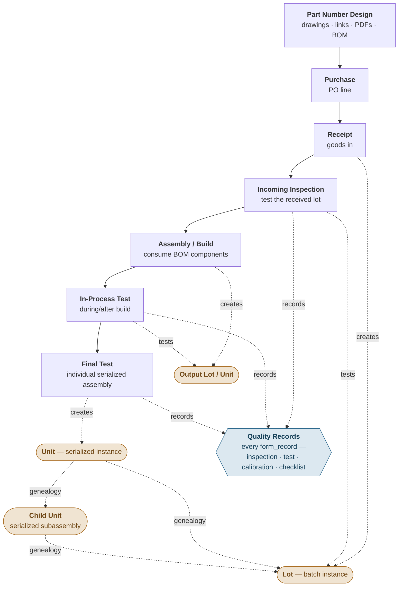
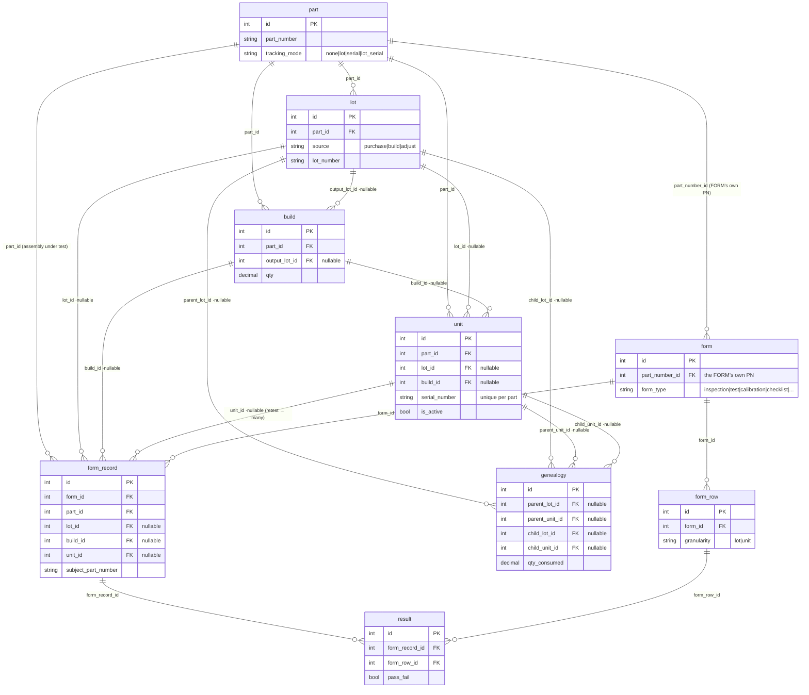

# Traceability Data Model — Part → Lot → Unit

**Status:** DRAFT / not frozen. Nothing here is committed until the §9 freeze checklist is checked
and an epic issue is filed. Sub-issues are carved **after** freeze, from the migration path (§5),
not from the target schema.

**Epic issue:** _TBD_ (file once frozen; rename this doc to `<epic#>-traceability-data-model.md`).

**Supersedes:** the `trace_id` / `is_batch` issue set — #702 (parent thread), #713
(serial_number→trace_id), #714 (is_batch + compound trace_id), #715 (build detail view), #716
(embedded build UX) — each closed as superseded and pointed back at the epic.

---

## 0. Flow — part number through to final test

The lifecycle this model has to support, end to end and change-controlled. The identity tier
each stage produces or acts on is shown on the right.

**Tiers produced along the way:** Receipt mints a **Lot** (Tier 2); a Build produces an output
**Lot** or **Unit** and records genealogy back to what it consumed — component **lots** and
individual serialized **child units** alike, in one `genealogy` edge table (Q11); Final/unit testing
mints a **Unit** (Tier 3), a serialized instance whose as-built tree traces back through both its
child units and its lots — the per-serial "birth certificate." Every step is a change-controlled
quality record — the whole point of the system.

---

## 1. Goal (milestone v0.7)

Integrate the full sequence of testing **from receipt through final testing of individual
assemblies**, in a change-controlled manner. Concretely the model must represent, as first-class
data (not parsed strings or proxy flags):

- Incoming inspection of a purchased lot.
- In-process / post-assembly testing of a build.
- Final testing of an **individual serialized assembly**.
- Retest of one failed unit drawn from a batch.
- The provenance chain: which raw lots → which build → which output lot/units → which test events.

## 2. Core thesis

Identity is a three-tier hierarchy, each tier a **real table**, never one overloaded string:

| Tier | Table | Answers | Exists today? |
|------|-------|---------|---------------|
| 1 · catalog | `part` | what a thing *is* | yes |
| 2 · batch instance | `lot` | which batch | yes (#676) |
| 3 · serialized instance | **`unit`** (new) | which exact one | **no — this is the gap** |

The `unit` table is the piece Arx lacks. A serial number becomes a **row with real FKs**
(`part_id`, nullable `lot_id`, nullable `build_id`), not a parsed string like `LOT123.4` — replacing
the `trace_id` / `is_batch` approach (#702).

Nullable FKs — not flags or parsed strings — carry the model:

- **`unit.lot_id` nullable** — set for `lot_serial` parts (a serialized unit inside a lot);
  NULL for serial-only parts with no batch. One `unit` table serves both.
- **`form_record.unit_id` nullable (Q8)** — a whole-lot/batch form_record leaves it NULL; a per-unit
  form_record points at the tested unit. One form_record/result shape carries both granularities, no
  separate batch structure.

"Is this a batch?" needs **no flag**: a form_record is a batch because it links a lot/build and has
no `unit_id`; a unit form_record sets `unit_id`. Retest of unit 4 = a new form_record with `unit_id`
pointing at that same unit. No compound string, no ambiguous delimiter, no `is_batch` boolean.

## 3. `unit` name — freed by renaming UoM → `uom`

`unit` **currently** means the unit-of-measure reference table (`part.unit_id → unit.unit_id`,
`supplier_part.unit_id`). **Decision:** rename the UoM table `unit` → `uom` (and `part.unit_id` /
`supplier_part.unit_id` → `uom_id`) **first**, as part of the front rename wave (§5/§7). This
absorbs **#712** as an epic prerequisite and frees the `unit` name for the Tier-3 serialized-instance
table. No collision remains.

## 4. Target schema (end-state, grounded to current tables)

Only the identity + testing core. Inventory ledger, BOM, purchasing, and pricing tables are real
but out of scope here **except** where §6 open questions force an interaction.

### 4.1 New / changed tables

All constrained-value columns below (`none|lot|...`) are **`VARCHAR` + `CHECK` constraint**, not a
native enum type or a lookup table — see §4.3 for why. `?` marks a nullable FK.

| Table | Status | Key columns / additions | Notes |
|-------|--------|-------------------------|-------|
| `part` | existing | `+ tracking_mode` | `VARCHAR`+`CHECK`: `none\|lot\|serial\|lot_serial`; replaces `is_lot_tracked` |
| `lot` | existing | `+ source` | `VARCHAR`+`CHECK`: `purchase\|build\|adjust`; today inferred from `po_line_id` |
| `unit` | **NEW** | `id`, `part_id` FK, `lot_id` FK?, `build_id` FK?, `serial_number`, `is_active` | `serial_number` is a STRING (non-numeric serials), UNIQUE per `part_id` |
| `form_record` | = `test_record`, reshaped | `form_id`, `part_id`, `lot_id?`, `build_id?`, `unit_id?`, `subject_part_number`, `subject_pn_description` | disposition derived (Q3); `subject_*` = snapshot of the part the record is about (was `serial_number_pn`/`_pn_desc`) |
| `result` | = `test_result`, reshaped | `form_record_id`, `form_row_id`, `pass_fail` | unit granularity via `form_record.unit_id` (Q8) |
| `form` | existing | `+ form_type` | `VARCHAR`+`CHECK`: kind of quality document — `inspection\|test\|calibration\|checklist\|batch record` (Q10); orthogonal to existing `record_types`; `part_number_id` stays (the FORM's own PN) |
| `form_row` | = `test_definition`, renamed | `+ granularity` | a form line (test / heading / instruction / …), not only a "test"; `VARCHAR`+`CHECK` granularity: `lot\|unit` |
| `build` | existing | — | unchanged |
| `genealogy` | = `lot_genealogy`, widened | `parent_lot_id?`, `parent_unit_id?`, `child_lot_id?`, `child_unit_id?`, `qty_consumed` | one edge table for all provenance; CHECK: exactly one parent FK + exactly one child FK set (Q11); recurse for the as-built lot+unit tree beneath any output |

Relationships between those tables (only the columns needed to show the links):

### 4.2 Old → new mapping (for reviewers who know today's schema)

| Today | Target | Note |
|-------|--------|------|
| `part.is_lot_tracked` (bool) | `part.tracking_mode` (VARCHAR+CHECK `none\|lot\|serial\|lot_serial`) | adds the serial axis Arx has no concept of today |
| `test_record` | `form_record` | rename + reshape |
| `test_record.serial_number` | **gone** — replaced by `unit` rows + nullable `form_record.unit_id` (Q8) | this is the whole point; kills the `trace_id`/`is_batch` idea |
| `test_record.serial_number_pn` / `_pn_desc` | `form_record.subject_part_number` / `subject_pn_description` — kept in place | snapshot of the part-under-test's PN/desc; *not* serials, and *not* the `unit` table (see §4.3) |
| `test_result` | `result` (child FK `record_id` → `form_record_id`) | one table, both granularities; unit granularity lives on `form_record.unit_id`, not here (Q8) |
| `unit` (UoM) | `uom` | renamed to free `unit` for Tier-3 (§3, absorbs #712) |
| `form` (record_types, instrument_types, revision) | `form` + `form_type` | change-control columns **stay** (Q4); `part_number_id` unchanged — it's the FORM's own PN |
| `test_definition` (spec_*, pf_type, archived, history) | `form_row` + `granularity` (`test_definition_history`→`form_row_history`, `test_id`→`form_row_id`) | it's a form line — test / heading / instruction / … — not only a "test"; change-control machinery **stays** (Q4) |
| `lot` (po_line_id NULL ⇒ built) | `lot.source` explicit | today source is inferred; make it a column |
| `lot_genealogy` (lot→lot only) | `genealogy` (lot + unit endpoints) | records serialized-child provenance, not just lots — enables per-serial as-built genealogy (Q11) |

### 4.3 Column-type & FK conventions

**"Enum" columns are `VARCHAR` + `CHECK`, not a native enum type and not a lookup table.**
SQL Server has no native `ENUM`, and Arx's established pattern for a small, stable, *code-branched*
value set is exactly this — `part.category`, `part.release_status`, `inventory_transaction.txn_type`
are all `VARCHAR` + `CHECK`. `tracking_mode`, `lot.source`, `form.form_type`, and
`form_row.granularity` are the same shape: the app branches on these values in code, so a
new value has no meaning until code handles it — which is precisely when a `CHECK` (a small, guarded
migration to widen it) is correct and a user-editable lookup table would be wrong. Reserve lookup
tables (like `uom`, or the `app_config` category lists) for sets users extend without code changes;
these are not that. `CHECK` also works identically across SQL Server and Postgres (#625), whereas a
native Postgres `ENUM` would diverge from the SQL Server DDL. So: **`VARCHAR` + `CHECK`.**

**Snapshot columns stay on `form_record`, and avoid the `unit` table name.** `serial_number_pn` /
`serial_number_pn_desc` are a denormalized snapshot of the **part-under-test's** number and
description, frozen on the quality record at creation. They must stay on `form_record` (not move to
`unit`): a lot/batch form_record has **no** `unit` row, yet still needs the subject part's PN
snapshotted. Renamed to `subject_part_number` / `subject_pn_description`. We avoid `tested_*`
because `form_record` is general (inspection/calibration/checklist, not just tests), and we avoid
`unit_part_number` because `unit` is now a **table name** (the Tier-3 serialized instance) —
`unit_part_number` would read as "a column relating to a `unit` row" (a FK-like link) when it is
really a frozen string copied off `part`. `subject_*` — the part the record is about — says exactly
what it is across every form type. (This retargets #717.)

### 4.4 FK cleanup in scope

New tables/columns this epic creates get **real FKs from birth** (`unit.part_id`, `unit.lot_id?`,
`unit.build_id?`, `form_record.unit_id`, `genealogy.parent_unit_id?`/`child_unit_id?`, and the
retained `form_record`/`result`/`lot`/`build`/`genealogy` links) — no legacy data, no sentinels,
nothing to defer.

Two **legacy** logical references get promoted here because the epic already reshapes their tables
(each gated on an ArxProd orphan check; keep `ON DELETE NO ACTION`; both dialects):

- **`form.part_number_id` → `part.id`** — clean `NOT NULL` ref (the FORM's own PN); promote while
  we're in `form` DDL for `form_type`.
- **`test_record`→`form_record`.`part_number_id` → `part.id`** — promote during the reshape.

Every **other** deferred logical reference (`contact.company_id`, `part.default_supplier_id`, and
the `0`-sentinel `part.price_id` / `part.primary_attachment_id`, which need a none-`0`→`NULL`
conversion + code change before a FK is even possible) is **out of scope** — tracked in **#735**.

## 5. Migration philosophy — "from scratch" is the *design*, not the *rewrite*

The design starts clean; the **implementation migrates a live DB with a ~2200-line `records.go`
built on `test_record`/`test_result` column names.** Do not let greenfield leak into big-bang.
Adoption order — renames first, in isolation:

1. **Rename wave, isolated PR(s):** `test_record`→`form_record`, `test_result`→`result`,
   `test_definition`→`form_row` (`test_definition_history`→`form_row_history`, `test_id`→`form_row_id`),
   and UoM `unit`→`uom` (`part.unit_id`/`supplier_part.unit_id`→`uom_id`, absorbing #712; see §3).
   Pure renames, no behavior change — stand up and test the reshaped DB before anything is built on
   it. Get the churn against `records.go` out of the way while behavior is provably unchanged, and
   free the `unit` name for step 2.
2. **Additive keystone:** add the `unit` table (Tier-3), a nullable `form_record.unit_id` FK (Q8),
   and `tracking_mode` on part. Units are created **lazily, one at a time at test time** (Q5) —
   independent of inventory (Q2). Then widen `lot_genealogy`→`genealogy` (Q11): add
   `parent_unit_id`/`child_unit_id` and the exactly-one-parent/child CHECK, so a build writes one
   edge per consumed lot **or** unit.
3. **Enum formalization:** `lot.source`, `form.form_type`, `form_row.granularity`.
4. **Behavior:** derive batch-vs-unit from structure; completeness "N tested of build.qty" (Q6);
   retest = a unit-testing form_record pointing at the same unit.

Throughout, honor the Q4 constraint: don't strand the revision-control snapshot columns or the
`form_row_history` trigger — leave real change control (v0.9) easy to add later.

## 6. Design decisions (resolved)

Each decision has a stable ID (`Qn`) referenced inline throughout; the rationale lives only here.

- **Q2 — Unit ↔ inventory / stock. → RESOLVED: fully decoupled.** `stock_on_hand` stays
  `SUM(inventory_transaction.qty)`, unchanged. **Unit count is independent of inventory; inventory
  needs no knowledge of units, and no `unit` row is ever written in an inventory transaction.**
  There is no reconciliation requirement — if a build makes 20 and only 19 are ever tested, there
  are 19 `unit` rows and that's correct; the 20th is simply untested/unaccounted. A future flag or
  report could surface a units-vs-build-qty mismatch, but that is **out of scope** for v0.7.
  **Two separate ledgers, do not conflate:** `inventory_transaction` is the **stock ledger** (signed
  qty movements → `stock_on_hand`); `genealogy` (Q11) is the **provenance record** (which lots/units
  went into which). A build writes both — quantity rows to inventory, parentage edges to genealogy —
  but a traceability walk reads only `genealogy`, never the stock ledger.
- **Q3 — `disposition`: computed or stored? → RESOLVED: computed/derived.** Keep Arx's current
  approach — derive pass/fail from results + spec; do not store a `disposition` column that can
  drift. The `form_record` pass/fail roll-up is computed at read time, not persisted.
- **Q4 — Change control placement. → RESOLVED (scope): deferred to v0.9.** Full change control is a
  later (v0.9) feature. v0.7 keeps the **existing limited revision control** as-is
  (`form.revision`, `test_record`/`form_record`.`form_revision` snapshot, `test_result`/`result.*`
  snapshots, `form_row_history`). **Constraint on this epic:** every schema decision here
  must leave adding real change control later *easy*, not foreclosed — don't reshape `form_record`/
  `result` in a way that strands the snapshot columns or the history trigger. Carry this as a
  review lens on every sub-issue, not as work in v0.7.
- **Q5 — Unit lifecycle. → RESOLVED: lazy, one at a time, at test time.**
  - A `unit` row is created **one at a time**, when that individual unit is tested (unit testing).
    **No bulk/eager add** — a build of 20 does *not* pre-create 20 unit rows.
  - Consequence: unit-row count is the *numerator* of completeness, not the denominator
    (see revised Q6). Units are independent of both inventory (Q2) and lot/build quantity.
  - Units exist **only** for `tracking_mode` `serial` / `lot_serial`, and only for items actually
    unit-tested — which naturally bounds row volume.
  - `is_active` for scrap; `serial_number` is a string entered at test time, **UNIQUE per `part_id`**,
    editable until the unit's first *locked* form_record.
  - **Provenance invariant (the linchpin of "trace any unit back").** `unit.lot_id` and
    `unit.build_id` are individually nullable, but a unit with **both** NULL is orphaned — it
    defeats traceability and Q6 completeness. Enforce that every `unit` carries at least one:
    `CHECK (lot_id IS NOT NULL OR build_id IS NOT NULL)`, plus app-level assignment at creation
    (a build-sourced unit gets `build_id`; a received-lot unit gets `lot_id`). FK constraints alone
    won't catch this — call it out as an explicit invariant.
  - **Batch vs unit testing:** unit testing = one form_record per unit → one `unit` row, full
    per-parameter results. Batch testing = one lot/build-granularity form_record covering many units
    at once (whole-lot y/n), which does **not** enumerate or create per-unit rows.
- **Q6 — Completeness "19 of 20 tested". → RESOLVED.** Track completeness as
  `COUNT(units for the build/lot) / build.qty (or lot qty)`. The **denominator is the build/lot
  quantity, which already exists**; the **numerator is the count of unit-tested units**. Missing
  units (built-but-untested) are simply absent from the unit table — a future report can surface the
  gap (out of scope).
- **Q8 — per-record unit m2m. → RESOLVED: not m2m; use a nullable
  `form_record.unit_id` FK.** A form_record covers at most one specific serialized unit (unit
  testing); batch testing is whole-lot and enumerates no individual units. So there is no
  form_record↔unit many-to-many — no join table, add a nullable `form_record.unit_id`. Retest = a
  unit-testing form_record
  with `unit_id` set.
  - **FK-consistency invariant across the four form_record FKs (`part_id`, `lot_id`, `build_id`,
    `unit_id`).** When `unit_id` is set, the unit already knows its `part_id`/`lot_id`/`build_id`, so
    setting those independently on the form_record invites redundant or *contradictory* state. Rule:
    when `unit_id` is present, read lot/build **through the unit** and leave `form_record.lot_id` /
    `build_id` NULL (or, if denormalized for query speed, enforce they equal the unit's). Document
    this; a CHECK can't span the FK join, so it's an app-layer invariant.
- **Q9 — Form ↔ Assembly many-to-many. → RESOLVED: already exists, no schema change.** A **Form is
  itself a part** (`part.category = 'FORM'`); `form.part_number_id` links to the FORM's *own* part
  number (inspection/test plans have PNs) — **not** to the assembly under test. The FORM part carries
  a **BOM**, whose components are the assembly part numbers the form applies to. So Form → many
  assemblies (its BOM lines) and assembly → many Forms (it appears in many FORM parts' BOMs). The
  m2m is provided by the existing (Form-is-a-part + BOM) mechanism. **No `form_part` junction, no
  drop of `form.part_number_id`.** A `form_record` still carries both `part_id` (assembly under test)
  and `form_id`; applicability is validated by the form's BOM containing that part.
- **Q10 — `form.form_type` value set. → RESOLVED.** `form_type` is a **new** column (there is no
  existing `inspection_type`/`record_type` column to rename from). It is a single `VARCHAR`+`CHECK`
  naming the **kind of quality document** the form is:
  `inspection | test | calibration | checklist | batch record`.
  `form_type` and the existing `form.record_types` are **kept as two orthogonal axes** — do not
  merge. `form_type` (single, template-level) = what the document *is*; `record_types` (plural,
  comma-separated, per-form, drives conditional row visibility on records) = *why this fill-out
  happened*. Every combination is legal (`test`+`retest`, `calibration`+`retest`, …); merging would
  force compound values and break record-type-driven visibility.
  - `batch record` **moves** from `record_types` → `form_type` (it's a document kind, not an
    occasion).
  - `record_types` value set becomes:
    `new release | retest | upgrade | rma evaluation | rework | requalification | first article`.
  - No separate stage axis (incoming/in-process/final) — stage is read from where in the flow the
    form sits, not stored on the form.
- **Q11 — Genealogy across tiers. → RESOLVED: one `genealogy` edge table.** A build's consumed
  parents and children can each be a **lot** (batch component) or a **unit** (serialized
  subassembly), so a serialized top assembly records both its lot components and its individual
  serialized children. A single
  `genealogy(parent_lot_id?, parent_unit_id?, child_lot_id?, child_unit_id?, qty_consumed)` carries
  every combination, with a CHECK enforcing **exactly one parent FK and exactly one child FK** set.
  Each column is a real FK, so integrity holds. Recurse it to build the as-built lot+unit tree
  beneath any output — the per-serial "birth certificate." Widened from today's `lot_genealogy`
  (lot→lot only); existing lot→lot rows stay valid (unit columns NULL) through the guarded migration.

## 7. Sub-issue carving (DRAFT — finalize after freeze)

Carved from the migration path (§5), one shippable guarded-migration slice each, dependency order:

0. **Expand seed data → migration testbed (PRE any code change).** Before the rename wave, grow
   `SQL/seed_test_data.sql` into a representative PRE-state dataset so the big rename/reshape
   migration can be dry-run PRE→POST and verified end-to-end. TODO: assess whether the current seed
   is already large enough (its own design pass).
1. **Rename wave** — `test_record`→`form_record`, `test_result`→`result`, `test_definition`→`form_row`,
   UoM `unit`→`uom` (absorbs
   #712). Pure renames, isolated, tested standalone. Front of the epic; may be one PR or split
   (TR-rename vs UoM-rename) since they're independent.
2. **`unit` table** (DDL both dialects, seed, `*Table()` helper, SCHEMA.md, migration) — keystone.
   Lazy one-at-a-time creation at test time (Q5), independent of inventory (Q2).
3. **`genealogy` table** — widen `lot_genealogy` (add `parent_unit_id`/`child_unit_id`, the
   exactly-one-parent/child CHECK; Q11); builds write one edge per consumed lot or unit.
4. **`form_record.unit_id`** — nullable FK (Q8; no join table). Also promote
   `form_record.part_number_id` → real FK during the reshape (§4.4).
5. **`tracking_mode`** on part (migrate `is_lot_tracked` values).
6. **Enum formalization** (`lot.source`, `form.form_type`, `form_row.granularity`).
   Promote `form.part_number_id` → real FK while in `form` DDL (§4.4).
7. **Create/render logic** — derive batch-vs-unit from structure; completeness "N of build.qty"
   (Q6); retest = a unit-testing form_record pointing at the same unit.
8. **Build/lot/unit traceability view** (re-scoped #715 — read-only drill-down + indexes). Walks the
   single `genealogy` edge table to render the as-built lot+unit tree beneath any output.
9. _(optional)_ embedded build-at-test-time UX (re-scoped #716) — highest risk, last.

## 8. Stays outside the epic

- **#717** — `serial_number_pn` / `_pn_desc` → `subject_part_number` / `subject_pn_description`, kept
  on `form_record` (see §4.3). Independent of the traceability core; can land anytime, but the
  rename fits naturally in the step-1 rename wave.
- **#712** — **absorbed into the epic.** It's the UoM `unit`→`uom` half of the step-1 rename wave
  (§3), not an outside cleanup. Close/relabel it accordingly when the epic is filed.

## 9. Freeze checklist

- [x] All §6 design decisions resolved and recorded inline.
- [x] `unit.serial_number` = string, UNIQUE per `part_id`; `tracking_mode` migration maps
      `is_lot_tracked` `0→none`, `1→lot` (`serial`/`lot_serial` set per-part afterward; existing
      data implies neither).
- [ ] Migration slices (§7) each map to exactly one guarded migration.
- [ ] Epic issue filed; this doc renamed with its number; superseded #702 set closed.
